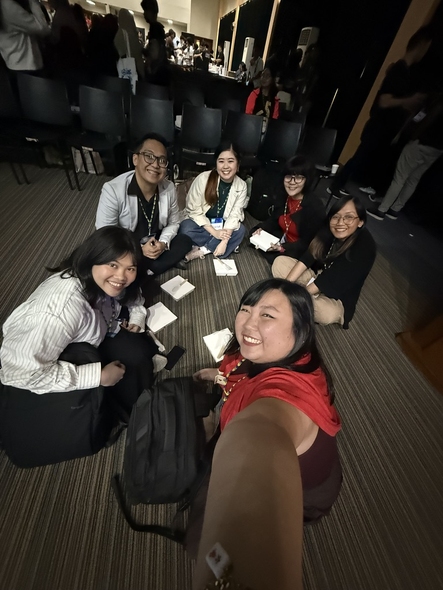
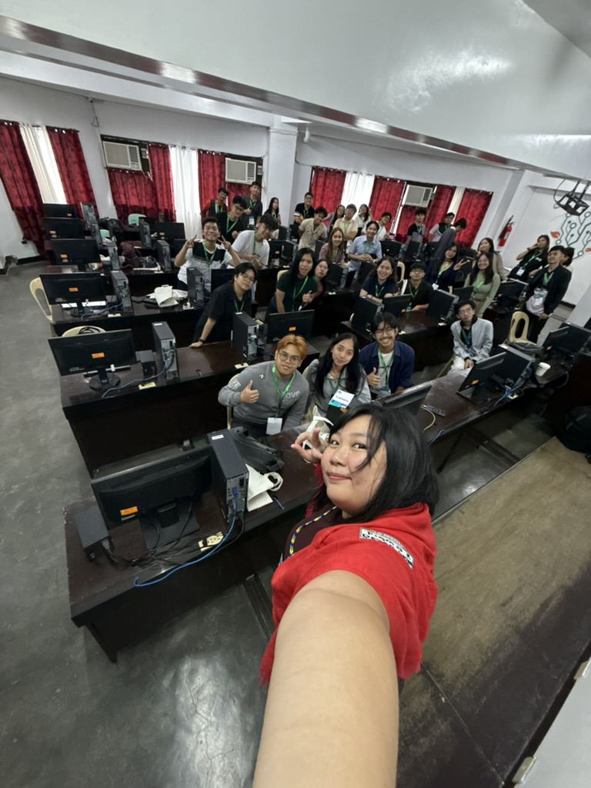
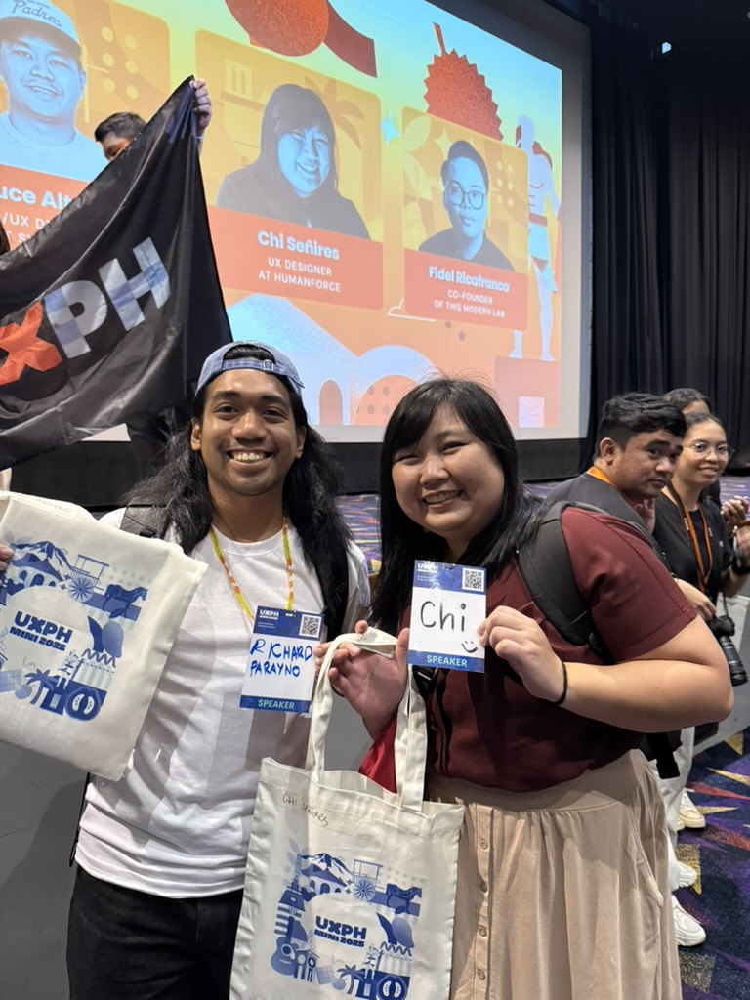
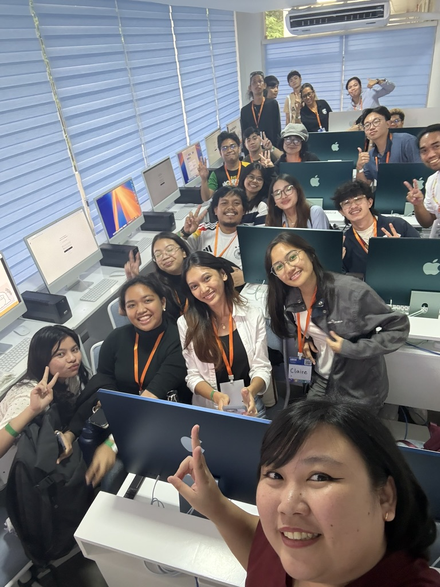
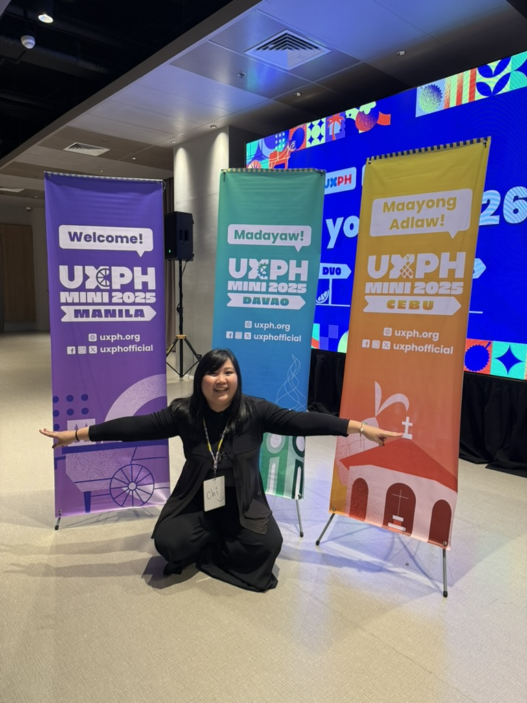
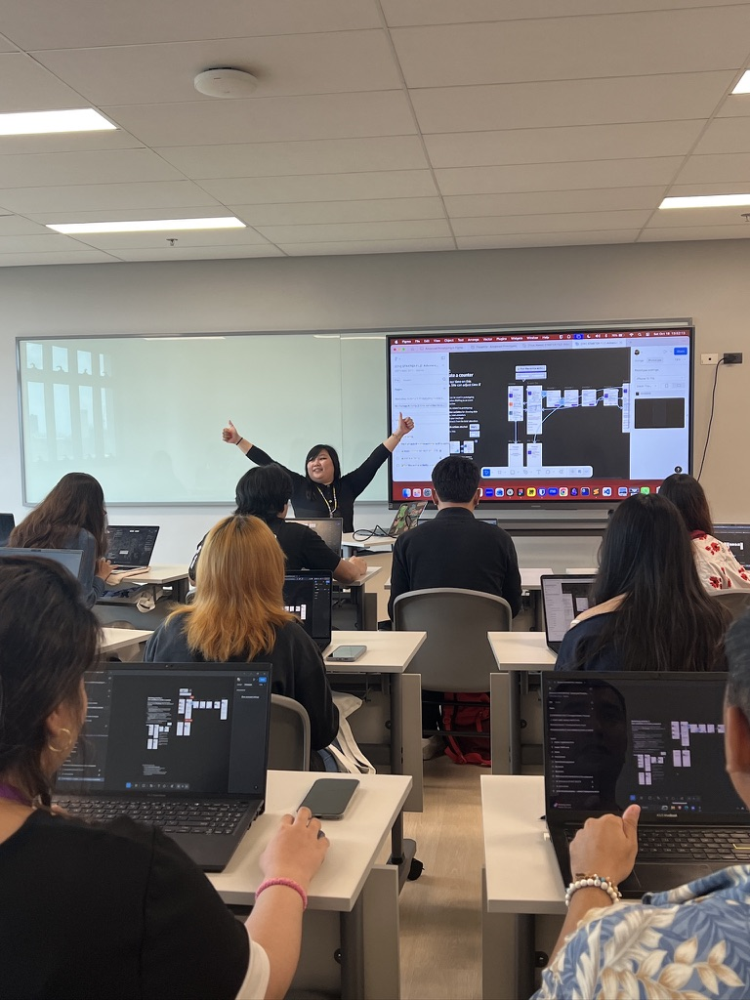
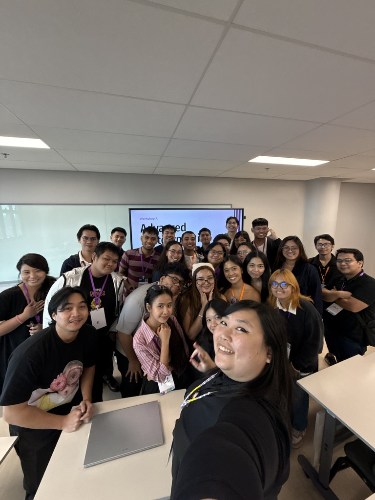

It’s been around 2 weeks since [UXPH Mini 2025](https://2025.uxph.org) concluded and I have a lot of things to share–currently still drafting a blog entry for this XD—but I just want to attempt to get some initial thoughts out so I could post about it already hahaha

All 3 legs of UXPH Mini 2025 were great in their own ways. The fact that [UXPH](https://uxph.org), [CebUXD](https://facebook.com/CebUXD), and [UX Davao](https://uxdavao.org/) all got together to plan this out and execute it is already a feat in itself.

It’s very easy to stick to the comfort zone of just holding events within Metro Manila all the time and having our peers from other regions in the country to figure out their way to go here, but to be able to bring the same conference experience (it’s supposed to be a “mini” but as Aldrich said, we scope creeped ourselves 😂) while making it unique to each region + to have done this set of events again—the first time this was done was in 2019 with the UXPH Roadshow—is a feat that I know only those who care about the community can do. It’s tiring work, but worth it nonetheless.

I’m also grateful I got to facilitate my workshop with UXPH, given that I do want more people to know about the things you can do with Prototyping in Figma Design (while it’s still a feature in the platform lol) and a lot of people did sign up and attend my workshops! All 3 workshop legs were full, and for each leg, the way I delivered the workshop evolved a bit in the hopes that I get to teach or share all the things I wanted to share during that time to everyone :)) I think I definitely can work better on containing the things I want to teach within the given time frame, or maybe save this kind of workshop if I do have more time to do so XD but either way, it was a great and fulfilling experience to go through, especially during the times people would be amazed that “wow, you can do that?” and see the awe in their eyes 😁

Super big kudos to everyone who made this happen! I don’t know how this would be topped in 2026 so that it’s not a “mini” anymore XD but I’m sure we’ll surprise ourselves with what we can achieve since we have so many talented people giving their time and paying it forward to the community 😄

lol this is supposed to be short but I guess it ended up being a mini blog post in itself :)) so here are some moments I’d like to share (for now the captions are in the `title` tags for these images, but I’m working on setting up markup for my blog to output these within `<figcaption>`s instead):

> (this will be posted in a different order on social media for highlighting purposes but for the purpose of having the photos in order here, I’ll add a heading based on the particular leg 😆)

### Davao leg

### Cebu leg

### Manila leg

 I have everything")
