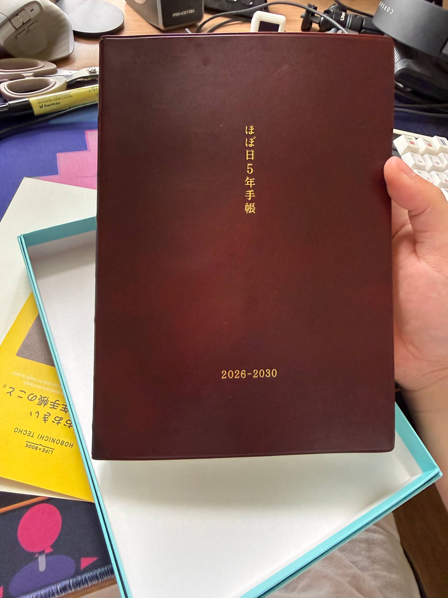
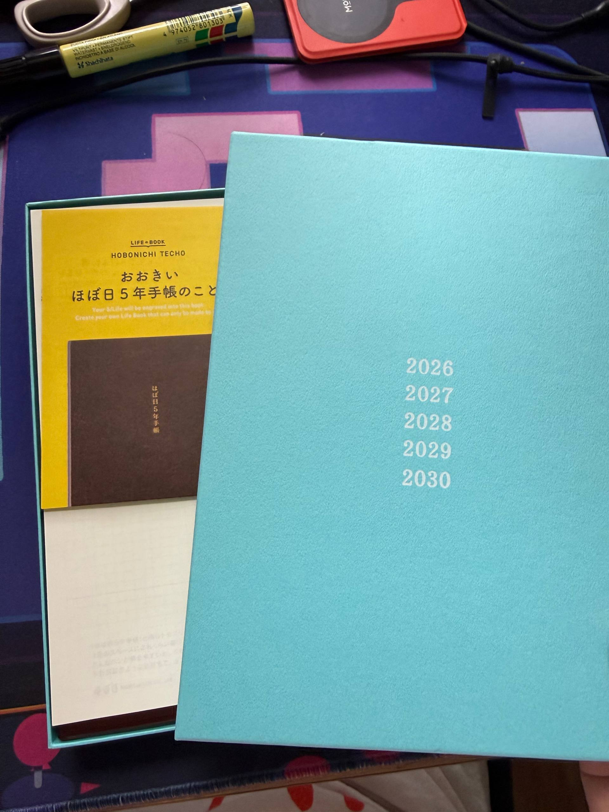

Just got my [hobonichi 5-year planner](https://www.1101.com/store/techo/en/5year/)! I initially learned about this from a friend of mine who started journalling last year, also with a 5-year planner (but hers is from 2025–2029).

I also am happy I can still somewhat read Japanese, since I still remember my hiragana.

In this case,
- “おおき” is “big”
- “ほぼ日” is `hobonichi`, though I didn’t initially know that “日” was read as `nichi`

I also still remember *some* kanji, so…
- “年” is for year, though I didn’t know that it could be read and typed as `toshi`
- based on the romaji text above the image, I assumed that “手帳” meant `techo`, which I assumed meant “planner”, but according to [Google Translate](https://translate.google.com/?sl=ja&tl=en&text=%E6%89%8B%E5%B8%B3&op=translate), it means “pocketbook”.

Then the part that just goes “のこと”, I had to double check what it meant. Initially thought it meant “this is the…”, but it seems to be more accurate to translate it as “about (the thing)” or “regarding (the thing)”. I just knew that “ここ” meant “here” so I used that knowledge + context clues to get an idea of what it was saying.

I love the feel of the paper, and I’m excited to start the year with it! I’m hoping all the pens I will use for writing in this notebook would not damage the paper huhu 🙏

Another friend suggested to also get a cover for this for long term protection in case it’ll get battered through use over time. I did consider it initially when I was ordering, but when I saw the price of just getting a hobonichi cover… 🥶 I kinda shuddered HAHA (the journal itself already cost a lot, then I have to do that transaction all over again? 😅) In hindsight, I could’ve bought one *with* a cover, but when I was browsing thru Shopee, I don’t think I saw any. Or even if I did, I didn’t think I’d need it. So here we are now. 😆

I do hope it sticks with me. I did already try to use Obsidian to be the place where I do my daily journaling, as I [wrote in a previous post](/blog/my-personal-obsidian-vault-setup/) that I do have daily notes there, but after hearing about the idea of the hobonichi journal essentially being you just going through the notebook 5 times (for 5 years), I liked the idea.

I’ve also been looking for a way to *write* so I can journal or just remember things by. As much as I love typing, I see the benefit of actually writing stuff down, since it’s another way to express one’s self. Also, I don’t want to forget how to write haha

So here’s to the start of something new for me 😁 There are a bunch of pages in the back that are more for personalizing the journal itself, so I’ll go and write in those so I can make this journal more mine. 😊

